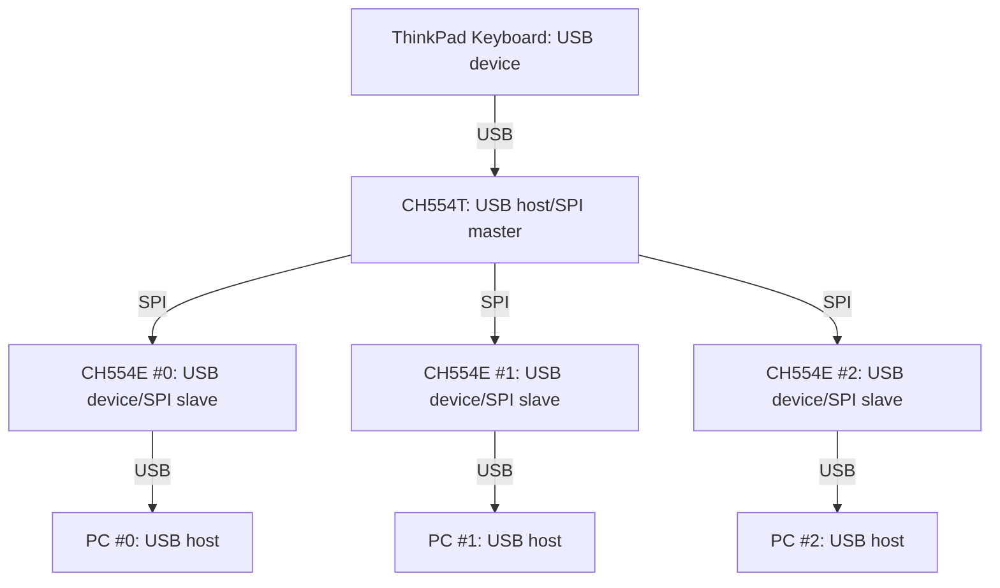

# ThinkPad Keyboard Switcher

They can share a ThinkPad USB Keyboard with a track pointer to three PCs.

## Chart

## Build
```
git submodule init ch554_sdc
git submodule update ch554_sdc

cd device  
make

cd ../host  
make
```

## Pin Assign
### 3X CH554E (behaves for a USB device of a PC)

| pin # | name | function | 
| --- | --- | --- |
| 1 | P1.4/SCS  | SPI Slave Chip Selector |
| 2 | P1.5/MOSI | SPI MOSI |
| 3 | P1.6/MISO | SPI MISO |
| 4 | P1.7/SCK  | SPI Serial Clock |
| 5 | RST       | Hardware reset |
| 6 | P3.6/UDP  | USB Data (+) |
| 7 | P3.7/UDM  | USB Data (-) |
| 8 | GND       | |
| 9 | VCC(5V)   | |
| 10 | V33      | |

### 1X CH554T(behaves for a USB host of a keyboard)

| pin # | name | function |
| --- | --- | --- |
| 1 | P3.2/INT0 | ACT0 (if PC #0 connected) |
| 2 | P1.4/TIN2 | CE0 (SPI Slave Chip Selector for PC #0) |
| 3 | P1.5/MOSI | SPI MOSI |
| 4 | P1.6/MISO | SPI MISO |
| 5 | P1.7/SCK  | SPI Serial Clock |
| 6 | RST       | Hardware Reset |
| 7 | P1.0/TIN0 | LED0 (indicator of PC #0) |
| 8 | P1.1/TIN1 | LED1 (indicator of PC #1) |
| 9 | P3.1/TXD  | CE1 (SPI Slave Chip Selector for PC #1) |
| 10 | P3.0/RXD  | ACT1 (if PC #1 connected) |
| 11 | P3.3/INT1 | LED2 (indicator of PC #2) |
| 12 | P3.4/T0   | CE2 (SPI Slave Chip Selector for PC #2) |
| 13 | P3.5/T1   | ACT2 (if PC #2 connected) |
| 14 | P3.6/UDP  | USB Data (+) |
| 15 | P3.7/UDM  | USB Data (-) |
| 16 | P1.3/TXD_ | TX (UART TX for debug) |
| 17 | P1.2/RXD_ | SW (button) |
| 18 | GND       | |
| 19 | VCC       | |
| 20 | V33       | |
